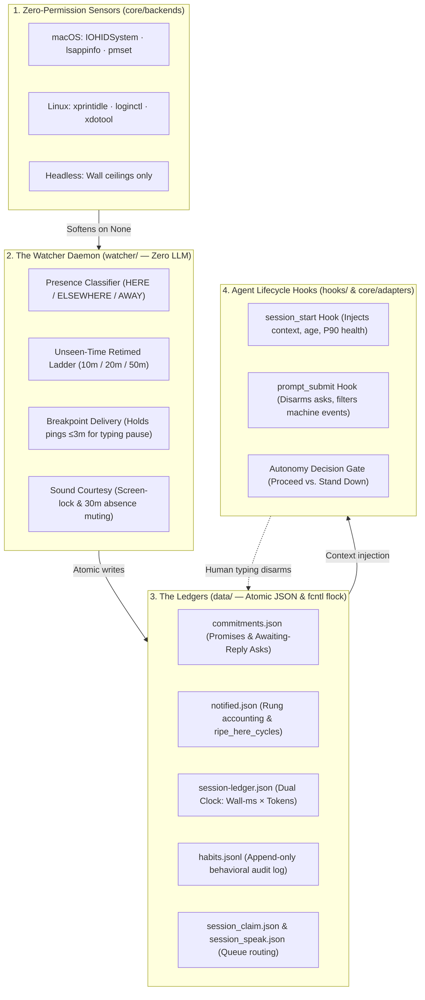

<!-- markdownlint-disable MD033 MD041 -->
<p align="center">
  
</p>

<h1 align="center">Sundial</h1>
<p align="center">
  <b>A sense of time for AI agents. Local-first, zero-dependency, no LLM in the loop.</b>
</p>

<p align="center">
  
  
  
  
  
  
  
</p>

---

> ### ✦ *"Sundial measures absence, not time."*

Your coding agent asks you a question and you step away. Today, nothing happens — the session hangs, the question rots, and the work stalls.

**Sundial is the missing half of human-in-the-loop:** when the human becomes the blocker, the agent's clock keeps running. It nudges you on your desktop, escalates politely through absence, greets you with continuity upon your return — and if you never answer, the agent proceeds on its stated judgment or stands down.

**Deterministically. With zero model calls. 100% local.**

---

## ❖ Core Value Pillars & Architecture Pipeline



### 1. The Presence-Scaled Absence Ladder

Escalation advances **only while you genuinely haven't seen the chat**:

```text
          you ask ──► 10 min unseen ──► 20 min ──► 50 min ──► agent decides
presence:   HERE ▸ clock paused (you can see the chat — silence means "not now")
       ELSEWHERE ▸ half speed  (you're in another app — popups may name it)
            AWAY ▸ full speed  (nobody's home — sound travels farther than pixels)
backstop: a wall ceiling forces the final rung, whatever the sensors say
```

* **Urgency Tiers (`--weight`):**
  * `high`: Retimed ladder (5m / 10m / 20m), **40m wall ceiling**, speaks final rung aloud.
  * `normal`: Default ladder (10m / 20m / 50m), **90m wall ceiling**, 3 rungs.
  * `low`: Slower ladder (30m / 90m), **3h wall ceiling**, 2 rungs.

### 2. Bounded Breakpoint Delivery

A ripe nudge never fires mid-keystroke. Drawing from **Interruption Science**, the daemon holds ripe notifications for up to **3 minutes** waiting for a natural typing gap or application switch before delivering.

### 3. Sound Courtesy with Manners

Chimes escalate with urgency (**Tink → Glass → Hero**, and **Purr** on return). Sound volume softens when you are busy elsewhere, and **mutes unconditionally** if your screen is locked or you have been away > 30 minutes. Popups and ledger tracking run 24/7.

### 4. Self-Calibrated Task Estimation (`lib/estimator.py`)

Agents stop guessing with fabricated human calendar weeks. Sundial tracks the **empirical ratio distribution** (`R = actual_s / est_s`) across completed tasks in `habits.jsonl` to output calibrated **P50 and P90 execution durations** with small-n honesty floors (2.0× floor when N < 5, and > 20.0× outlier clamp).

### 5. Session-Voice Queue Routing

When a live agent session is open (verified via `session_claim.json` heartbeat), non-terminal rungs route silently into the session queue (`session_speak.json`) so the agent speaks them in-context. Terminal rungs mirror to both desktop and chat.

---

## ❖ Technical Feature Matrix

| Subsystem | Features & Capabilities | Performance & Safety Posture |
| :--- | :--- | :--- |
| **Presence Engine** | • Zero-permission OS reads (`HIDIdleTime`, `LSDisplayName`, `pmset`) · Tri-state classification: `HERE` (chat visible), `ELSEWHERE` (other app), `AWAY` (idle) · Live WebRTC & Meet detection (`in_call`) | • **Softening Rail:** Missing sensors return `None` and soften to wall time — never block · Zero window titles or keystroke contents read |
| **The Watcher Daemon** | • Pure Python stdlib date arithmetic (Zero LLM) · **Breakpoint Delivery:** Holds ripe pings ≤ 3 min for typing pauses · **Sound Courtesy:** Mutes audio when screen is locked or absent > 30 min | • **≤ 3 Pings Cap** strictly enforced per item · Single-driver verification enforced by [`cli/doctor.py`](file:///Users/OTI_1/Desktop/sundial-staging/cli/doctor.py) · 24/7 background operation |
| **The Ledgers** | • Atomic replacement via `NamedTemporaryFile` + `fsync()` + `os.replace()` · Inter-process locking via `fcntl.flock` on `data/.lock` · Automatic corrupt byte quarantine (`.corrupt-<timestamp>`) | • **Call-Time Path Derivation:** Live data cannot be wiped by test suites · 100% git-ignored state directory |
| **Self-Estimation Loop** | • Empirical ratio distribution (`R = actual_s / est_s`) calibration · Small-n honesty floor (2.0× multiplier when N < 5) · Outlier clamp (> 20.0× excluded as calendar idleness) | • Computes empirical **P50 / P90** durations · `sanity_line` warns at task creation if deadline is tighter than historical P90 |
| **Universal Adapter** | • Generic Hook Protocol: JSON on stdin → text block on stdout → `exit 0` always · Supported adapters: `claude-code`, `hermes`, and `generic` · Machine event detection (`<task-notification>`, `[SYSTEM NOTIFICATION`) | • **Fail-Safe Contract:** Clock errors silently exit 0 with empty output; never blocks an interactive shell |

---

## ⬡ Verdict & Autonomy Vocabulary

When an agent blocks on an awaiting-reply question (`sundial ask "<question>"`), the ladder climbs until expiry, triggering the **Autonomy Gate** ([`lib/policy.py`](file:///Users/OTI_1/Desktop/sundial-staging/lib/policy.py)):

```text
┌─────────────────────────┬─────────────────────────────────────────────────────────────┐
│ Verdict                 │ Condition & Contract                                        │
├─────────────────────────┼─────────────────────────────────────────────────────────────┤
│ REQUIRE_EXPLICIT_YES    │ Action flagged --irreversible; silence NEVER authorizes it. │
│ PROCEED                 │ Reversible AND confidence ≥ 0.95.                           │
│ PROCEED (Present-Silence│ Reversible AND confidence 0.80–0.95 AND ripe_here_cycles ≥ 3│
│          Proven)        │ (User sat in front of the chat for ≥30m without objecting). │
│ STAND_DOWN              │ Confidence < 0.80 or insufficient presence proof.           │
└─────────────────────────┴─────────────────────────────────────────────────────────────┘
```

> **The Autonomy Rule:** Silence-while-present is an answer; silence-while-absent is a void. They receive distinct, deterministic responses.

---

## ⌘ Quickstart

### 1. Installation

```bash
# Clone the repository
git clone https://github.com/bigjoe-oti/sundial.git ~/sundial
cd ~/sundial

# Run the installer for your target platform
./setup.sh --name "YourName" --fresh
```

`setup.sh` wires the lifecycle hooks, compiles the identified notifier applet (`Sundial.app`), configures the launchd daemon, and initializes your agent's `birth.json` timestamp.

### 2. Multi-Platform Targets

Sundial v3 supports multiple host environments via `--platform`:

```bash
./setup.sh --platform macos   # Default: compiled applet + launchd watcher
./setup.sh --platform hermes  # Hermes integration checklist (hooks + cron tick)
./setup.sh --platform linux   # Linux systemd timer + notify-send helper
```

### 3. CLI Command Reference

```bash
# Query the clock, agent age, and due commitments
sundial now

# Arm an awaiting-reply nudge when blocked on the human (with active autonomy fallback)
sundial ask "Should the navigation header be sticky?" \
  --due +10m \
  --weight normal \
  --confidence 0.95 \
  --default "Make it sticky and continue" \
  --on-proceed "git checkout -b feat/sticky-nav && ./build.sh"

# Record a ripening commitment with self-calibrated estimation
sundial remember "Refactor auth middleware" --due 2026-09-01 --est 45m --bucket build

# Mark commitments complete (records actual duration into habits.jsonl)
sundial done <id>

# Run comprehensive system diagnostics
sundial doctor

# Launch zero-dependency MCP stdio server for Cursor, Antigravity, Windsurf
sundial mcp

# Output unified read-only status for UI surfaces (SwiftBar / Waybar)
sundial status --json
```

---

## ⬡ Extension Points & Configuration Reference

Configure Sundial behaviors without modifying source code by placing plain text files in `data/`:

| File | Format | Purpose |
| :--- | :--- | :--- |
| `data/owner.txt` | Single string | Owner name used in personalized notification copy |
| `data/meeting_apps.txt` | App name per line | Allowlist for meeting detection (`zoom.us`, `Teams`, `FaceTime`, etc.) |
| `data/watch_roots.txt` | Path per line | Roots scanned for new project subfolders (default: `~/Desktop`) |
| `data/ignore_paths.txt` | Path prefix per line | Paths the curiosity sensor should never mention |
| `data/chime.txt` | `'off'` or float multiplier | Volume scaling for audio alerts (`0.5`, `1.0`, or `off`) |
| `data/speak.txt` | Voice name (or empty) | Opts into speaking the final rung aloud via `/usr/bin/say` |
| `data/prep_enabled` | Empty file | Enables silent background meeting-notes drafting |

---

## ⬡ Repository Structure

```text
sundial/
├── bin/
│   ├── sundial                  # Unified CLI dispatcher (now, ask, due, mcp, ...)
│   └── sundial-hermes-hook      # Generic stdin/stdout JSON protocol hook
├── core/
│   ├── adapters.py              # AgentAdapter abstract contract
│   ├── backends.py              # PresenceBackend & NotifyBackend abstract contracts
│   ├── backends_impl/           # macOS, Linux, and Headless backend implementations
│   └── mcp_server.py            # Pure stdlib JSON-RPC 2.0 MCP server over stdio
├── lib/
│   ├── core.py                  # Atomic JSON IO, fcntl locks, birth, commitments
│   ├── policy.py                # Urgency tiers, ladder timing, autonomy gate
│   ├── estimator.py             # Ratio-distribution percentile engine (P50/P90)
│   ├── decay.py                 # ACT-R base-level activation memory decay ranker
│   ├── quiethours.py            # Deterministic learned quiet hours (sound-gated)
│   └── tzutil.py                # Local/UTC timezone transformations
├── watcher/
│   ├── watcher.py               # 24/7 daemon loop, breakpoint delivery, sound courtesy
│   ├── presence.py              # HIDIdleTime, lsappinfo, pmset assertion parsing
│   ├── opportunities.py        # Meeting detection, folder curiosity, habit logging
│   └── owner_model.py           # Statistical distillation of habit ledger into histograms
├── cli/                         # Atomic CLI verb scripts (ask, remember, due, doctor, etc.)
├── hooks/                       # SessionStart and UserPromptSubmit harness hooks

├── contrib/
│   └── sundial.30s.sh           # SwiftBar / Waybar menu-bar status plugin
└── tests/                       # 392 unit tests covering contracts, backends, and ledgers
```

---

## ✓ Testing & Code Quality Posture

Sundial enforces a zero-warning quality standard across all modules:

```bash
# Execute the full unit test suite (392 tests)
python3 -m pytest tests/

# Strict SOTA linting and style validation via Ruff
python3 -m ruff check .
```

---

## 📜 Documentation Index

| Document | Description & Audience |
| :--- | :--- |
| [docs/ARCHITECTURE.md](docs/ARCHITECTURE.md) | Technical architecture overview and actor separation model |
| [docs/escalation-then-autonomy.md](docs/escalation-then-autonomy.md) | The escalation ladder and terminal autonomy contract design |
| [docs/integrations/hermes.md](docs/integrations/hermes.md) | Hermes native hook and cron integration specification |
| [docs/superpowers/specs/2026-08-26-universal-backend-design.md](docs/superpowers/specs/2026-08-26-universal-backend-design.md) | Universal backend and agent adapter specifications |
| [docs/research/2026-07-17-temporal-scene-sweep.md](docs/research/2026-07-17-temporal-scene-sweep.md) | Adversarial prior art survey across HCI and agent research |
| [docs/notes/delivery-incident-2026-07-03.md](docs/notes/delivery-incident-2026-07-03.md) | Forensic post-mortem on macOS Notification Center attribution |

---

## 🔒 License & Lineage

Proprietary Lineage © **J. Servo LLC**. Released under the **MIT License**.

<p align="center">
  Built with obsession by <a href="https://jservo.com"><b>J. Servo</b></a> — <i>Agentic systems that keep their promises.</i>
</p>
